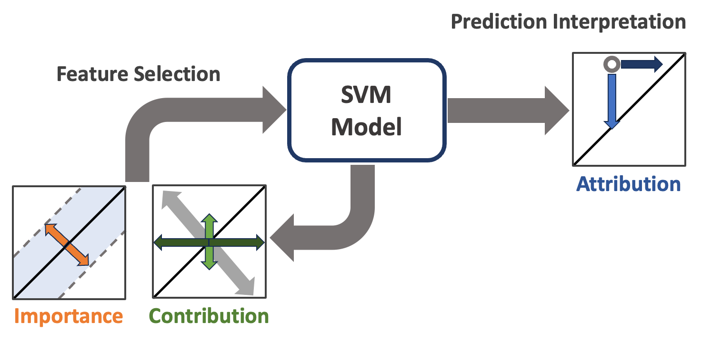

The MISTIC framework
====================

MISTIC organizes an interpretable SVM analysis into six connected layers:

   MISTIC connects model-aware feature selection to SVM fitting and prediction
   interpretation. Importance measures global model structure, contribution
   measures the response to feature perturbation, and attribution explains how
   features support an individual prediction.

The left side of the schematic is an iterative development-data loop. MISTIC
ranks candidate features or groups using importance and contribution evidence,
updates the selected set, and refits or retunes the SVM as configured. Once the
selection rule is fixed, the resulting model produces predictions and local
attributions for new observations. This separation matters: blind observations
belong only on the prediction-interpretation side and must not feed back into
feature selection.

The same workflow can be expressed through MISTIC's core software objects:

.. code-block:: text

   raw data
      │
      ├── preprocessing fitted on development data
      ▼
   cvSet ── reusable train/validation members
      ▼
   kernelWrapper + sklearn SVM + paramSet grid
      ▼
   svmSet ── tune members and fit a unified model
      ├── perturbation ranking
      ├── forward / backward / stochastic selection
      └── support vectors, gradients and integrated gradients
      ▼
   frozen pipeline ── blind predictions and explanations

Core objects
------------

``cvSet``
   Owns the development data and reproducible member splits. Classification,
   regression, independent, and one-class splitting strategies keep data
   partitioning separate from model logic.

``kernelWrapper``
   Computes linear, polynomial, or radial-basis kernels and their gradients.
   MISTIC can therefore perturb feature groups while holding the fitted dual
   coefficients fixed.

``paramSet``
   Keeps estimator parameters, such as ``C`` or ``nu``, paired with kernel
   parameters, such as ``gamma`` or ``degree``.

``svmSet``
   Coordinates tuning, selection, unified-model fitting, prediction, and
   explanations. Member models can share or independently select features and
   hyperparameters.

``combined_rank``
   Blends two views of relevance: a frozen kernel-objective criterion and the
   change in sample outputs after a feature or feature group is perturbed.

Model members and the unified model
-----------------------------------

Cross-validation members reveal stability across data subsets and drive model
selection. After feature selection, MISTIC fits a final unified model on the
development data. ``predict``, ``predict_proba``, and ``decision_function`` use
that unified model by default; ``prediction_mode="set"`` requests aggregate
member-set output instead.

Feature groups
--------------

Related columns can move together by supplying ``perturbation_sets``. Grouped
measurements can be normalized by the number of columns, its square root, or
not at all:

.. code-block:: python

   model = svmSet(
       estimator,
       splits,
       scorer.score,
       kernel=kernelWrapper("rbf"),
       perturbation_sets=[[0, 1, 2], [3], [4, 5]],
       perturbation_normalization="per_feature",
   )

``"per_feature"`` makes differently sized groups more comparable,
``"sqrt"`` provides an intermediate adjustment, and ``"none"`` preserves raw
group totals. Interpret a group rank as evidence about the group, not proof
that every member column is individually important.

Interpretation levels
---------------------

MISTIC exposes complementary evidence rather than one universal explanation:

* **global selection history** — which groups entered or left, and how
  validation performance changed;
* **global model structure** — support vectors, selected features, dual
  coefficients, and objective perturbation importance;
* **local perturbation** — how removing a group changes a sample's decision or
  positive-class probability;
* **local gradients** — infinitesimal sensitivity around an observation;
* **integrated gradients** — an additive path attribution from a reference to
  an observation.

Use several levels together. Agreement strengthens an interpretation;
disagreement often reveals interactions, correlated variables, or an
unrepresentative reference point.
