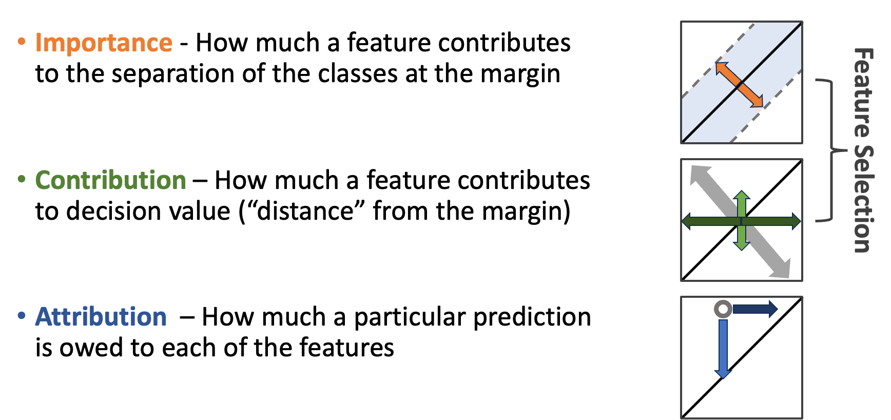

Interpretations and explanations
================================

An interpretation describes model structure or global behavior; an explanation
attributes a particular output. MISTIC provides both, and each answers a
different question.

Three complementary questions
-----------------------------

   Importance describes how strongly a feature or group participates in global
   model structure. Contribution measures how perturbing it changes the fitted
   model's output. Attribution assigns part of one prediction's difference from
   a reference to that feature. Importance and contribution can guide feature
   selection; attribution is primarily a prediction-level explanation.

These terms should not be treated as interchangeable. A feature can be
globally important yet have little effect for a particular observation. A
feature can also receive a strong local attribution even when correlated
alternatives reduce its selection frequency. In MISTIC:

* **importance** is represented by the kernel-objective or kernel-mass
  perturbation criterion used in ranking;
* **contribution** is represented by decision or probability changes after a
  feature or group is removed from the kernel calculation; and
* **attribution** is represented by an integrated-gradient allocation from a
  chosen reference observation to the observation being explained; and
* **boundary counterfactuals** identify local zero-decision points that show
  how an observation can move to the fitted classification boundary.

Feature selection can combine importance and sample-level contribution through
``combined_rank``. Attribution is evaluated after fitting and should not be
used to revise a model based on its blind-set explanations.

Feature rank
------------

Feature rank summarizes priority during selection. It is useful for reporting
which groups repeatedly enter or remain across member models. It is relative,
not a calibrated effect size, and correlated groups may exchange positions.

Report ranks alongside selection frequency and the validation-performance
curve. Avoid describing rank as a causal effect.

Support vectors
---------------

Support vectors are the training observations with nonzero dual coefficients.
They anchor the fitted boundary or regression tube. Inspecting their frequency,
class balance, and proximity to data-quality problems can reveal what the model
relies upon.

.. code-block:: python

   unified = model.unified_model_
   support_indices = unified.support_
   dual_coefficients = unified.dual_coef_

For precomputed kernels, scikit-learn's estimator does not store original
support-vector feature rows. Use ``support_`` to map back to the development
matrix retained by your analysis. Do not infer population prototypes: support
vectors are boundary-defining observations, not necessarily representative
ones.

Perturbation explanations
-------------------------

Decision and probability perturbations answer a discrete counterfactual:
*how would this fitted model's output change if this feature group contributed
no kernel information?* They are especially helpful for grouped variables and
nonlinear kernels.

.. code-block:: python

   local_margin_effect = model.decision_perturbation_(0, X_explain)

   # Binary probability-enabled SVC only:
   local_probability_effect = model.probability_perturbation_(0, X_explain)

Gradients
---------

``decision_gradient_`` and ``probability_gradient_`` measure infinitesimal
local sensitivity. Gradients depend on feature scale; compare them only after
considering preprocessing and units.

Boundary counterfactuals
------------------------

For a classifier, MISTIC can optimize a zero-decision point starting from each
observation. Each ensemble member has its own fitted boundary, so the result
retains a separate point for every member and sample:

.. code-block:: python

   counterfactuals = model.explain_counterfactuals(
       X_explain,
       feature_names=feature_names,
       target=y_explain,
   )

   member_zero_points = counterfactuals.values[0]
   feature_changes = counterfactuals.deltas
   boundary_distances = counterfactuals.distances
   optimizer_converged = counterfactuals.optimization_success
   counterfactual_table = counterfactuals.to_frame(model_index=0)

These are **boundary counterfactuals**, not automatically actionable recourse.
The optimization does not know which variables are immutable, which feature
combinations are feasible, or which changes can cause others. Inspect
``optimization_success`` and the residual ``decision_values`` before using a
point, and apply domain constraints before interpreting a change as a possible
intervention. Euclidean distances also depend on feature scale.

Integrated gradients
--------------------

Integrated gradients accumulate local gradients along a straight path from a
reference point to an observation. The attributions approximately sum to the
output difference between the observation and reference.

For a differentiable model output :math:`F`, input :math:`\mathbf{x}`, and
reference :math:`\mathbf{x}'`, the attribution to feature :math:`j` is
[#integratedgradients]_

.. math::

   \operatorname{IG}_j(\mathbf{x};\mathbf{x}')=
   (x_j-x_j')\int_0^1
   \frac{\partial F\!\left(\mathbf{x}'+
   \alpha(\mathbf{x}-\mathbf{x}')\right)}{\partial x_j}\,d\alpha.

The scalar :math:`\alpha` traces the straight path from the reference at zero
to the observation at one. Under the usual differentiability conditions, the
attributions satisfy the **completeness** property

.. math::

   \sum_{j=1}^{p}\operatorname{IG}_j(\mathbf{x};\mathbf{x}')
   =F(\mathbf{x})-F(\mathbf{x}').

MISTIC approximates each integral numerically with the configured
``num_steps``. The completeness residual is therefore a useful convergence
check: increase ``num_steps`` if the attribution sum is not sufficiently close
to the observed output difference.

.. code-block:: python

   import numpy as np

   reference = np.zeros(X_explain.shape[1])  # meaningful after standardization
   result = model.explain_integrated_gradients(
       X_explain,
       feature_names=feature_names,
       target=y_explain,
       reference_point=reference,
       num_steps=100,
       output="decision",
   )

   attribution_table = result.to_frame()
   global_ig_importance = result.importance

When no explicit reference is supplied for a classifier, MISTIC finds one
boundary counterfactual per sample and member, uses those points as the IG
references, and exposes the same computed result without a second optimization:

.. code-block:: python

   result = model.explain_integrated_gradients(
       X_explain,
       feature_names=feature_names,
       target=y_explain,
       num_steps=100,
   )
   boundary_counterfactuals = result.counterfactuals

Supplying ``reference_point`` answers a different baseline question and leaves
``result.counterfactuals`` as ``None``. Regression still requires an explicit
reference because an SVR does not define a classification boundary.

For a binary probability-enabled SVC, use ``output="probability"`` to explain
the positive-class member-set probability. The reference is part of the
question: zero is convenient for standardized data, while a real baseline or
cohort median may be more scientifically meaningful.

Triangulating evidence
----------------------

Use feature rank to describe selection, support vectors to identify boundary
anchors, boundary counterfactuals to inspect local routes to a decision
boundary, perturbations to test discrete removal, and integrated gradients to
allocate local output differences. When they disagree, investigate feature
correlation, interactions, saturation, and reference choice rather than
averaging the methods into one unexplained number.

Reference
---------

.. [#integratedgradients] Sundararajan, Taly, and Yan, `Axiomatic attribution
   for deep networks <https://proceedings.mlr.press/v70/sundararajan17a.html>`_,
   *Proceedings of Machine Learning Research* 70, 3319–3328 (2017).
