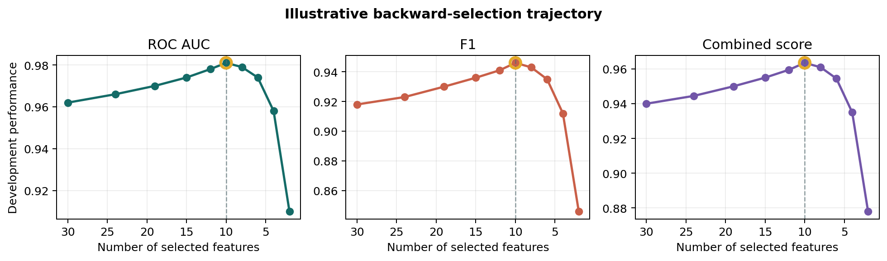
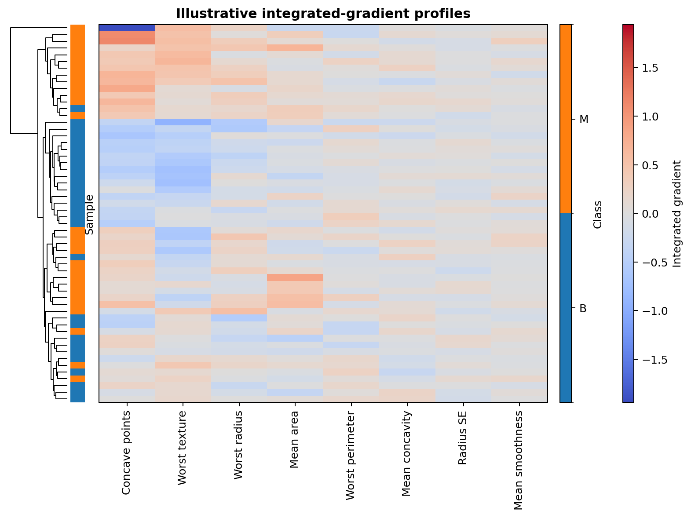
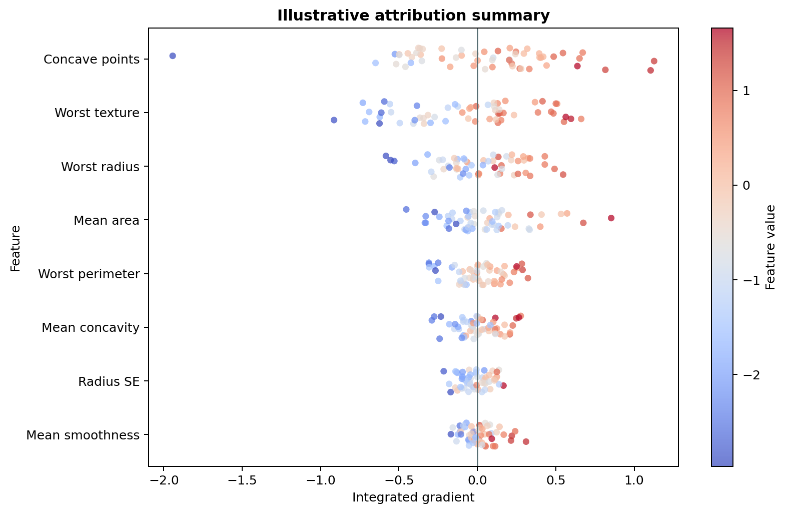
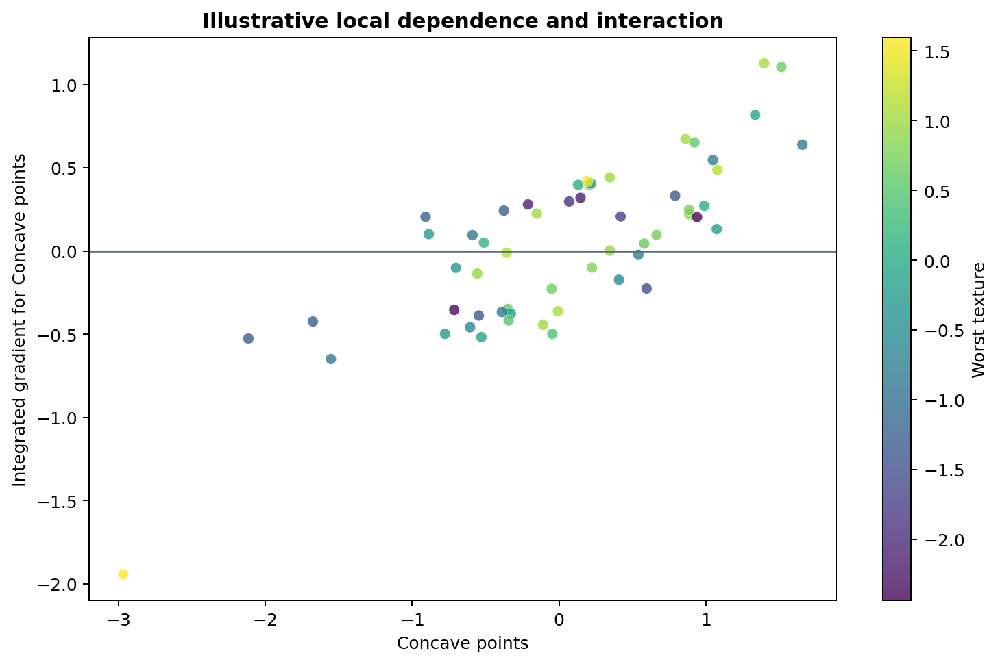

Visualizing results and explanations
====================================

Good visualizations separate model-selection evidence from blind evaluation
and distinguish global summaries from individual explanations.

Selection curves
----------------

Plot development performance against feature count for every metric used in
selection:

.. code-block:: python

   import matplotlib.pyplot as plt

   fig, axes = plt.subplots(1, 3, figsize=(12, 3.5))
   for ax, metric in zip(axes, ("auc", "f1", "score")):
       plt.sca(ax)
       model.plot_performance(metric=metric)
       ax.set_title(metric.upper())
   fig.tight_layout()

   Illustrative backward-selection trajectory. The gold ring marks the best
   observed point and the dashed line marks the selected ten-feature region.

Show uncertainty or member trajectories when possible. Mark the chosen knee;
do not present the best point without the path that produced it.

Integrated-gradient heatmaps
----------------------------

A heatmap shows sample heterogeneity and co-occurring attribution patterns:

.. code-block:: python

   fig, ax = plt.subplots(figsize=(9, 7))
   result.heatmap(
       ax=ax,
       cluster=True,
       cmap="coolwarm",
       target_strip_width=0.20,
       strip_pad=0.25,
   )
   ax.set_title("Integrated gradients by observation")
   fig.tight_layout()

   Illustrative clustered attribution profiles. Red and blue encode positive
   and negative integrated gradients; the side strip labels B and M classes.

A diverging color map should be centered at zero. Clustering is descriptive;
cluster boundaries are not validated subtypes.

Summary plots
-------------

The summary plot combines attribution magnitude, direction, and observed
feature value:

.. code-block:: python

   fig, ax = plt.subplots(figsize=(9, 7))
   result.summary_plot(
       ax=ax,
       max_features=20,
       cmap="coolwarm",
       random_state=7,
       scatter_kwargs={"s": 28, "alpha": 0.7, "edgecolors": "none"},
   )
   ax.set_xlabel("Integrated-gradient attribution")
   fig.tight_layout()

   Illustrative summary view. Horizontal position gives attribution, color gives
   standardized feature value, and vertical ordering follows mean absolute
   attribution.

Retain sign on the horizontal axis. A bar chart of absolute means alone hides
whether a feature raises or lowers outputs for different samples.

Interaction views
-----------------

An interaction plot explores whether one feature's attribution changes with a
second feature:

.. code-block:: python

   result.interaction_plot(
       feature="Concave Points mean",
       interaction_feature="Texture worst",
       scatter_kwargs={"s": 36, "alpha": 0.75, "edgecolors": "none"},
   )

This is an attribution-based interaction heuristic, not a formal statistical
interaction test. Use held-out follow-up analysis for confirmatory claims.

   Illustrative dependence view. Curvature or color separation can nominate an
   interaction for follow-up, but does not establish a statistical interaction.

Reporting checklist
-------------------

Label the modeled output, class orientation, reference point, feature scale,
sample cohort, and whether output came from the unified model or member set.
Use the same feature names and ordering across rank tables, plots, and exported
predictions.
